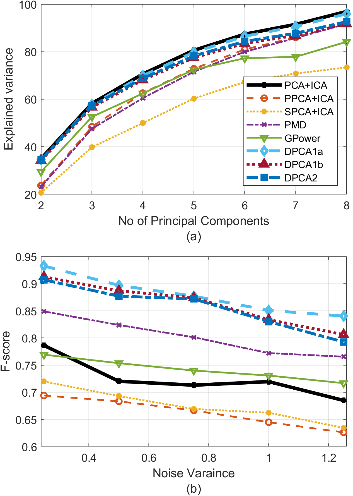

# Line plot using the Matlab code

| #  | Field Name            | Data                                                                   |
|----|-----------------------|------------------------------------------------------------------------|
| 1  | Arxiv URL             | [https://arxiv.org/abs/2411.12321](https://arxiv.org/abs/2411.12321)   |                                                                    
| 2  | Visualization IMG     |                                                |
| 3  | Visualization Caption | Comparison of different algorithms on synthetic data to illustrate the variance explained as the number of principal components varied from $2$ to $8$, and b) mean F-score over $10$ trials calculated for various noise variances across all algorithms. |
| 4  | Plotting Data         | [vari2.mat](vari2.mat) and [F_score.mat](F_score.mat)                                                                       |
| 5  | Code                  | [script_fig2.m](script_fig2.m)               |
| 6  | Command               | `script_fig2`                                                          |
| 7  | Natural Language Request | For the given data, create two line plots: (a) Explained Variance vs. Number of Principal Components, (b) F-score vs. Noise Variance, comparing methods like PCA+ICA, SPCA+ICA, PMD, GPOWER, DPCA1a (proposed), DPCA1b (proposed), and DPCA2 (proposed) |
